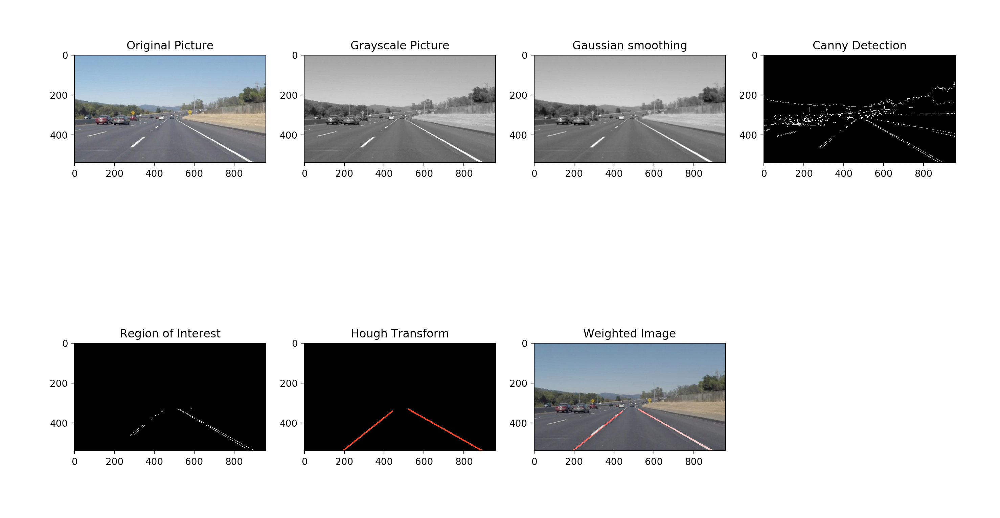

## 1. Finding Lane lines
### What is computer vision 
Computer vision is a scientific field, often drawing from artificial intelligence and machine lerning,that aims to teach computers to "see" by getting the computer to understand and appropriatedly respond to information gathered from the content of digital images.
### Step to find lane lines 
Useful features for identifying lane lines:color.shape,orientation,position

We'll start with color detection,the region masking,then finding edges,and finally using a Houng Transform to identify line segments
### Color selection
Value from 0(dark) to 255(bright) in Red,Green,and Bule.
Such as(255,255,255) indicate white.
### Region masking
Add criteria in code to only focus on a specific region of an imagin,since lane lines will always appear in the same general part of the image.
### Canny edge detection
Find edges by looking for strong gradient,i.e. very different values between adjacent pixels.

`edges = cv2.Canny(gray, low_threshold, high_threshold)`
### Hough transform
A line in image space can be represented as a single point in parameter space, or Hough Space

### Pipeline in picture view

